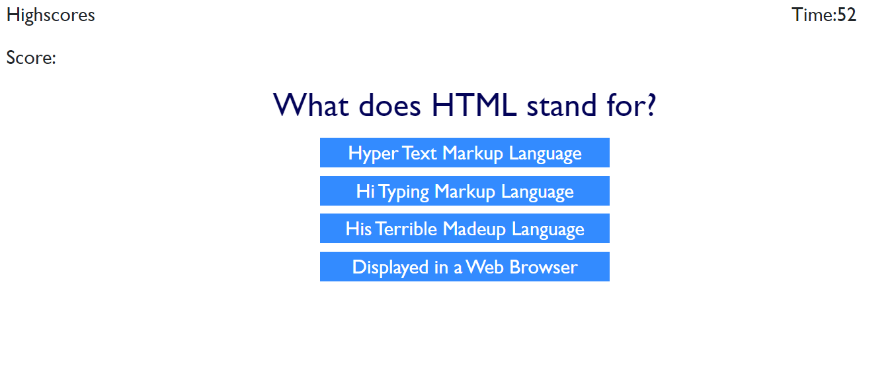

# Code Quiz
Assignment 4

## Description
The task of this assignment was to build a timed code quiz with multiple-choice questions. The deployed application shows understanding of Javascript particularly on click events, event listeners and timing functions and runs in the browser. It features a clean user interface is responsive.
The assignment criteria are:

WHEN I click the start button
THEN a timer starts and I am presented with a question
WHEN I answer a question
THEN I am presented with another question
WHEN I answer a question incorrectly
THEN time is subtracted from the clock
WHEN all questions are answered or the timer reaches 0
THEN the game is over
WHEN the game is over
THEN I can save my initials and score
* 

## Installation

## Usage
This has been deployed to the URLs 

* The URL of the deployed application is https://cazb67.github.io/code-quiz/

* The URL of the GitHub repository is https://github.com/CazB67/code-quiz

To take the Code Quiz follow the link above to the deployed application. Click on the 'Start Quiz' button. The user is then taken to the first question where they are given four options. 

The user then clicks the answer they think is correct and then the app moves on to the next question. When the time is up..........

## Credits
* Team at UWA Coding Bootcamp
* The following tutorial https://www.youtube.com/watch?v=49pYIMygIcU

## License
MIT License

Copyright (c) [2020] [Caroline Bates]

Permission is hereby granted, free of charge, to any person obtaining a copy
of this software and associated documentation files (the "Software"), to deal
in the Software without restriction, including without limitation the rights
to use, copy, modify, merge, publish, distribute, sublicense, and/or sell
copies of the Software, and to permit persons to whom the Software is
furnished to do so, subject to the following conditions:

The above copyright notice and this permission notice shall be included in all
copies or substantial portions of the Software.

THE SOFTWARE IS PROVIDED "AS IS", WITHOUT WARRANTY OF ANY KIND, EXPRESS OR
IMPLIED, INCLUDING BUT NOT LIMITED TO THE WARRANTIES OF MERCHANTABILITY,
FITNESS FOR A PARTICULAR PURPOSE AND NONINFRINGEMENT. IN NO EVENT SHALL THE
AUTHORS OR COPYRIGHT HOLDERS BE LIABLE FOR ANY CLAIM, DAMAGES OR OTHER
LIABILITY, WHETHER IN AN ACTION OF CONTRACT, TORT OR OTHERWISE, ARISING FROM,
OUT OF OR IN CONNECTION WITH THE SOFTWARE OR THE USE OR OTHER DEALINGS IN THE
SOFTWARE.
