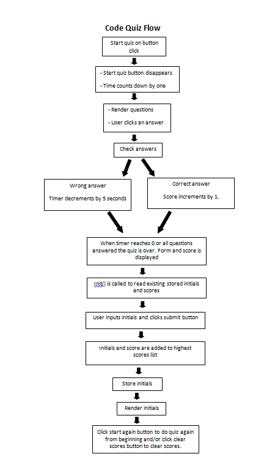
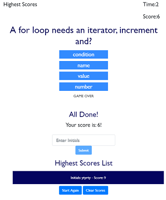

# Code Quiz
Assignment 4

## Description
The task of this assignment was to build a timed code quiz with multiple-choice questions. The deployed application shows understanding of Javascript particularly on click events, event listeners and timing functions and runs in the browser. It features a clean user interface and is responsive.
The assignment criteria are:
* A button that when clicked starts a timer and presents a question. 
* When that question is answered another question is asked.
* An incorrect answer causes time to be subtracted from the clock.
* The game ends when timer reaches 0 or all questions are answered.
* When the game is over initials and score are saved.

## Installation
To install this project I went over classroom activities and highlighted the code which would be relevant to this project. I looked at tutorials on writing quizes in Javascript, particularly the one credited below. Then a new repository was created and the relevant HTML, javascript and css pages created in VS Code. I added IDs for all the relevant parts of the HTML and then 'grabbed' and named them as variables in the .js file. First the timing functions were created to decrement time by both one and five seconds. Event listeners were then added and the main array of quiz questions and answers created. The renderQuestions and checkAnswer functions were then created, changed, added to and ammended. The 'todos' classroom activity was used as a reference point to input and store highest scores. Finally the app was cleaned up so that it looked better and issues fixed such as hiding the submit button so users don't enter their initials multiple times. I've tried adding variable names to these repetitive bits of code (document.getElementById("hide").style.display="block";) but the different states are difficult to control.

## Usage
This has been deployed to the URLs 

* The URL of the deployed application is https://cazb67.github.io/code-quiz/

* The URL of the GitHub repository is https://github.com/CazB67/code-quiz

To take the Code Quiz follow the link above to the deployed application. Click on the 'Start Quiz' button. The user is then taken to the first question where they are given four options. 

The user then clicks the answer they think is correct and then the app moves on to the next question. When the time is up or all questions have been clicked. The following appears.

The user then types in initials and clicks the submit button. Initials and score are then saved to the highest score list. The user then has the options to play again or clear scores by clicking the relevant button.

## Credits
* Team at UWA Coding Bootcamp
* The following tutorial https://www.youtube.com/watch?v=49pYIMygIcU

## License
MIT License

Copyright (c) [2020] [Caroline Bates]

Permission is hereby granted, free of charge, to any person obtaining a copy
of this software and associated documentation files (the "Software"), to deal
in the Software without restriction, including without limitation the rights
to use, copy, modify, merge, publish, distribute, sublicense, and/or sell
copies of the Software, and to permit persons to whom the Software is
furnished to do so, subject to the following conditions:

The above copyright notice and this permission notice shall be included in all
copies or substantial portions of the Software.

THE SOFTWARE IS PROVIDED "AS IS", WITHOUT WARRANTY OF ANY KIND, EXPRESS OR
IMPLIED, INCLUDING BUT NOT LIMITED TO THE WARRANTIES OF MERCHANTABILITY,
FITNESS FOR A PARTICULAR PURPOSE AND NONINFRINGEMENT. IN NO EVENT SHALL THE
AUTHORS OR COPYRIGHT HOLDERS BE LIABLE FOR ANY CLAIM, DAMAGES OR OTHER
LIABILITY, WHETHER IN AN ACTION OF CONTRACT, TORT OR OTHERWISE, ARISING FROM,
OUT OF OR IN CONNECTION WITH THE SOFTWARE OR THE USE OR OTHER DEALINGS IN THE
SOFTWARE.
